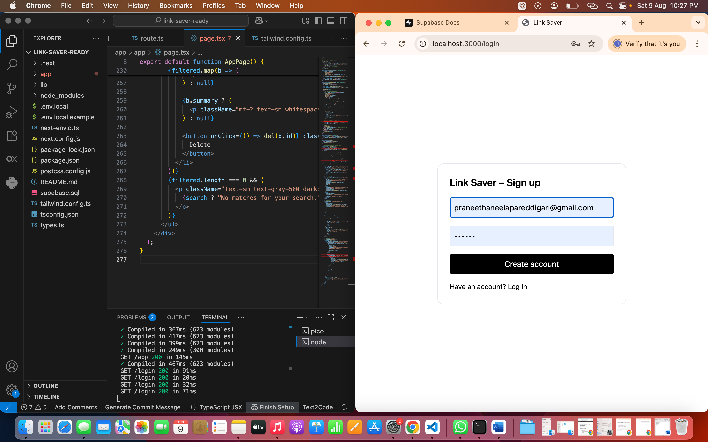
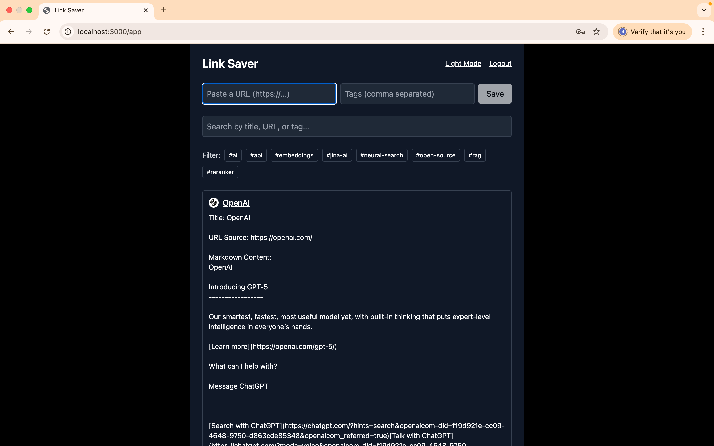

# Link Saver + Auto-Summary (OMVAD Internship – Take-Home)

A minimal, production-like Next.js app to save bookmarks with automatic summaries via **Jina AI** and authentication via **Supabase**.

### Tech Stack
- Next.js (App Router, TypeScript)
- Supabase Auth + Database
- Tailwind CSS
- Minimal API route for metadata & summary
- Vitest (1 tiny unit test)

## Demo
Deploy on **Vercel**. Add env vars: `NEXT_PUBLIC_SUPABASE_URL`, `NEXT_PUBLIC_SUPABASE_ANON_KEY`.
## Live Demo
https://link-saver-auto-summary-8f9qqgb6u.vercel.app
## Setup

```bash
npm i
cp .env.local.example .env.local  # fill Supabase URL + anon key
npm run dev
```

### Supabase SQL (schema + RLS)
See `supabase.sql`

### Scripts
- `npm run dev` — start dev server
- `npm run build` — prod build
- `npm start` — run prod
- `npm test` — run Vitest (unit test)

## How it works
1. Users sign up / log in with Supabase Auth.
2. `/app` page lets users paste a URL. The server route `/api/enrich`:
   - fetches the page (server-side; no browser CORS issue),
   - extracts title + favicon,
   - calls Jina AI (`https://r.jina.ai/http://<ENCODED_URL>`) to get a markdown-like plain-text summary.
3. We store `{ user_id, url, title, favicon, summary }` in the `bookmarks` table.
4. Row Level Security ensures users can access only their own rows.

## Time Spent
- Setup & Auth: ~45m
- CRUD + API route: ~60m
- UI polish: ~30m
- README + test: ~15m
- Deploy: ~15m

## Notes
- No external scraping libs to keep footprint tiny.
- Error handling: alerts on client; JSON error from API.
- Extend easily with tags, dark mode, and Google OAuth.

## Screenshots
(screenshots here after running locally)

### Login Page


### Redirect to Link Saver


### AI Summary (Light Mode)


### Redirecting to Link


### Dark Mode


### Search & Filters


